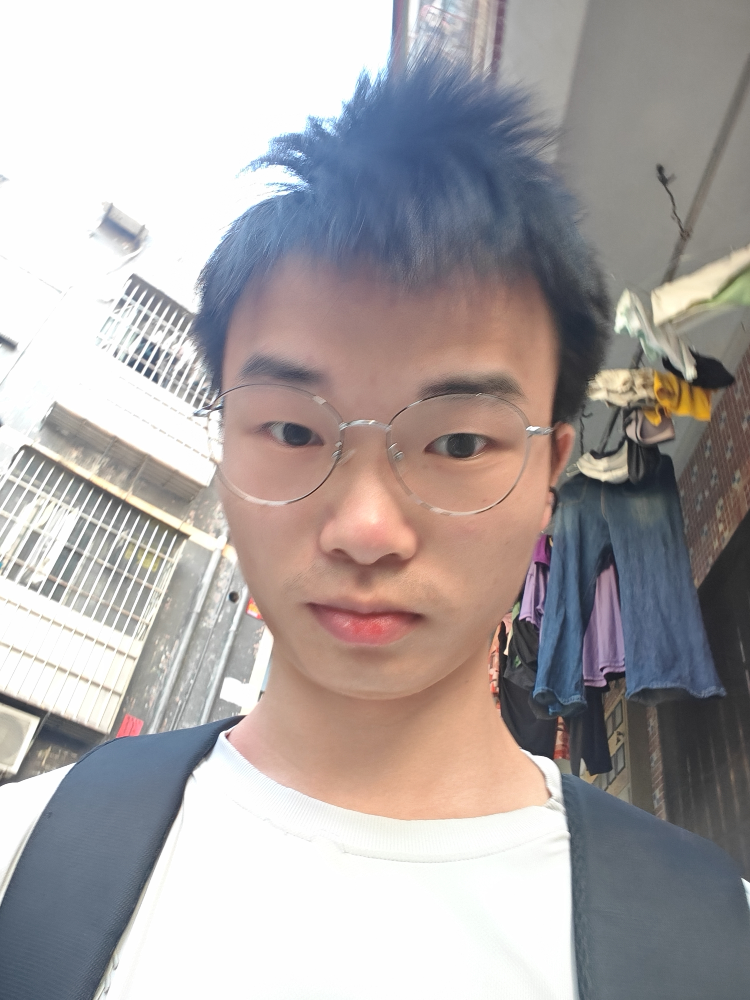
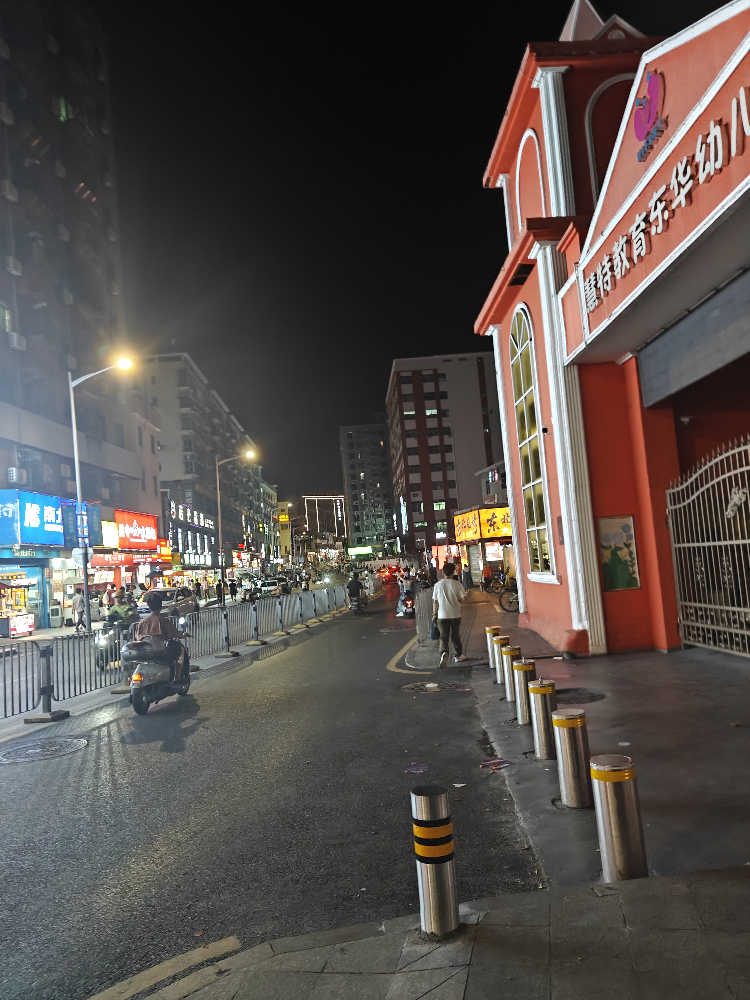
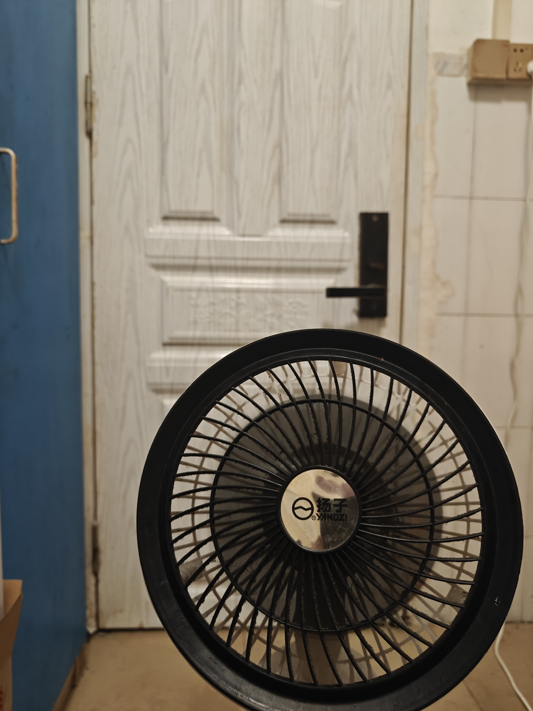

今天朋友圈里，同学们的保研结果出来了。都录取到了很不错的 92，厦大、北航、华科都有，还有人是直博的。看到这里，我第一反应是：他们都好优秀啊。我们一开始，大家都还只是同一所双非的学生。

现在感觉自己好垃圾。到目前为止，感觉我这一生好失败：没考上重点高中，没进 92，也没钱，什么都没有。

从一开始选了求职这条路，就觉得求职真的好累。现在这个大环境下，双非根本没机会，秋招这一路走得很难受啊。当然大家都难受，今天不管是考研的同学还是求职的同学，看着他们的好结果，都会对自己的未来感到焦虑。

明天就是中秋了，我的秋招还是 0 offer。全是一些测评，面试基本没有（也不算基本了，就是无）。这几个月，真的挺压抑的，是痛苦的。

是啊，中秋了。好几天前别人的公司就发了中秋福利，地铁上他们提着大包小包的礼盒，而我呢，什么也没有。对，一点东西都没有。

今天照常上下班，可一想起这些，就有种……我也说不出来的感觉。我当然为他们开心，但回头看看自己，什么都没有。

很想说点什么，却什么也说不出来。现在一个人待在出租屋里，感觉不到以后的日子有什么盼头，也不知道自己这条路走得对不对。

中秋过完就是国庆，我也不知道假期能做点啥。偶尔也会忍不住想哭。

确实不知道现在还有什么去处。人太多了，岗位太少了。迷茫。

算了，我也不知道自己在说啥了，就这样吧。

  
