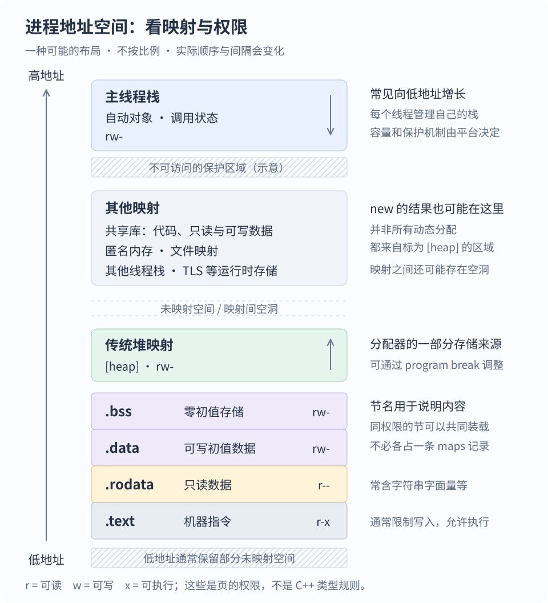
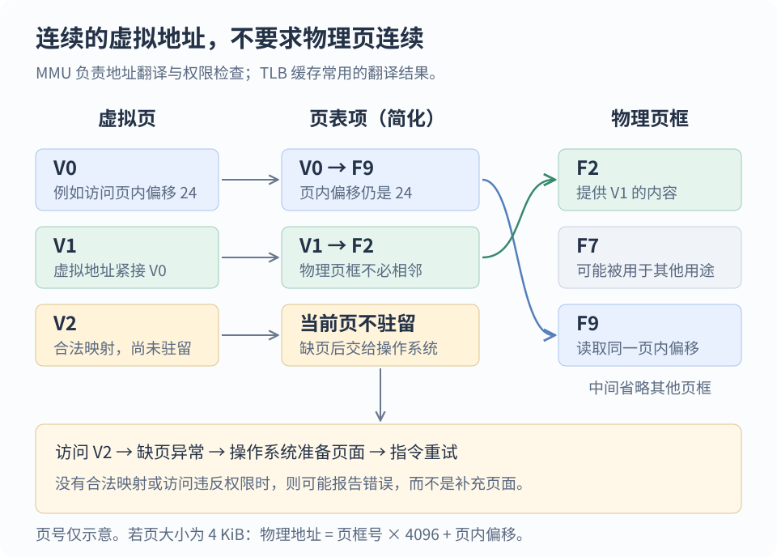
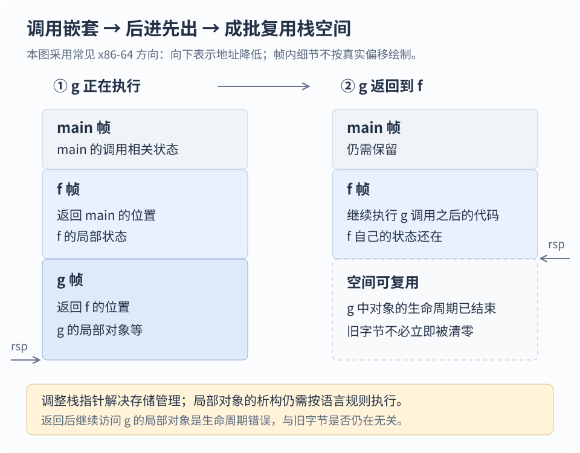
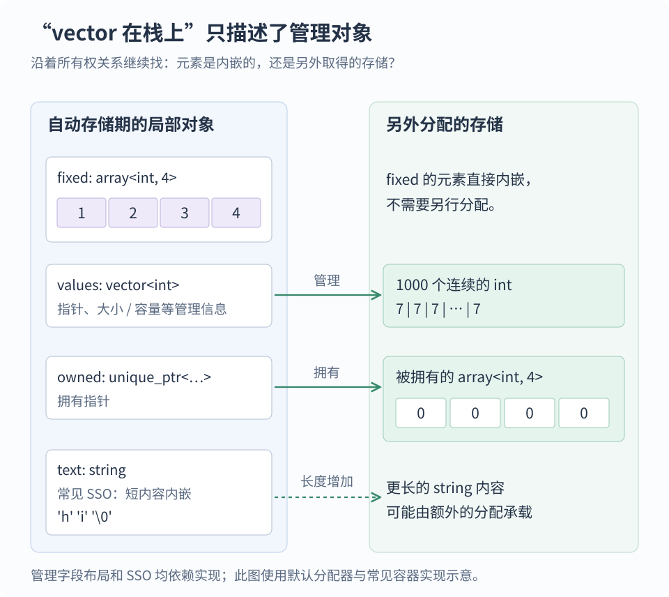

学 C++ 时，经常会看到一张图：代码区、常量区、全局区、堆区、栈区。接着记住几条规则：局部变量放栈上，`new` 出来的对象放堆上，全局变量放全局区。

这张图适合入门，但很快就会遇到解释不了的情况：

- 函数里的 `static` 变量为什么不会随函数返回而消失？
- 局部的 `std::vector` 明明“在栈上”，为什么能装下几百万个元素？
- `const int x = 3` 一定会进入只读区吗？
- `delete` 已经执行了，为什么进程占用的内存没有明显下降？
- 一块内存里还有原来的字节，为什么继续访问却是未定义行为？

要回答这些问题，需要把**语言规则、编译器实现、操作系统机制**接起来。本文先建立这三层的关系，再逐个拆解各个区域，最后用程序和系统工具验证。

文中的 C++ 示例以 **C++20** 为基准；涉及具体地址布局、ELF、寄存器和命令的部分，以 **Linux / x86-64 的常见实现**为例。Windows、macOS、嵌入式平台有不同的实现细节，C++ 的对象和生命周期规则仍然适用。

## 1. 先分清：位置、存储期、生命周期与作用域

面对一个变量，可以问四个不同的问题。

| 问题 | 对应概念 | 例子 |
| --- | --- | --- |
| 实际用哪些字节保存？ | 存储位置、内存布局 | 栈帧、可写数据映射、分配器管理的内存 |
| 承载对象的存储能保留多久？ | 存储期（storage duration） | 自动、静态、线程、动态 |
| 什么时候可以把这块存储当作这个对象使用？ | 对象生命周期（lifetime） | 初始化完成后开始，销毁或存储被复用时结束等 |
| 源代码的哪些地方可以使用这个名字？ | 作用域（scope） | 函数块内、命名空间内、类内 |

这些问题相关，但不能互相替代。再往工程上看，还需要第五个问题：**谁负责让对象在合适的时候销毁？** 这叫所有权，后面会用 RAII 说明。

### C++ 直接规定的是四种存储期

| 存储期 | 典型对象 | 存储保留的基本规则 |
| --- | --- | --- |
| 自动存储期 | 普通局部变量、函数形参 | 与所在块或函数调用的执行关联 |
| 静态存储期 | 非 `thread_local` 的全局变量、局部 `static`、字符串字面量 | 存储持续整个程序运行期 |
| 线程存储期 | `thread_local` 变量 | 每个线程一份，存储持续该线程的运行期 |
| 动态存储期 | 常规分配型 `new` 创建的对象等 | 按程序请求取得、释放存储，不由某次函数返回直接决定 |

“静态存储期”描述的是存储，不代表某个类对象从程序第一条指令起就已经构造好了。一个局部 `static` 对象可以拥有贯穿程序运行期的存储，却到第一次执行经过它的声明时才完成动态初始化。

**C++ 标准没有规定进程必须分成固定的五块，也没有要求每个自动变量都必须有一个栈地址。** 编译器只要保持程序应有的可观察行为，就可以把值放在寄存器里、直接折叠成常量，甚至消去整个对象的实际存储。

栈和堆是实现这些规则时很有用的机制。先有“什么时候需要保留对象”的需求，才有“用什么结构高效管理这些字节”的选择。

### 一个局部名字，可以对应一份长期存在的存储

```cpp title="局部 static：名字局部，存储长期存在"
int next_id() {
    static int value = 0;
    return ++value;
}
```

`value` 的名字只在函数块内可见，但它具有静态存储期。函数返回后，这份对象还在，下一次调用继续修改同一个 `value`。

普通局部变量则是另一个规则：每次执行到声明都会进行相应的初始化，离开作用域时结束这次对象的生命周期。实现可以反复复用同一段栈空间；**地址相同，也不意味着是同一个对象。**

作用域之外还有“链接性”：不同翻译单元里的声明能不能指向同一个实体。命名空间作用域的 `static` 常用于给予名字内部链接性，它不是一条“放到某个特殊内存区”的机器指令。

## 2. 一张进程地址空间图，应该怎样读

下面画的是一种常见的用户态**虚拟地址空间**示意。纵向表示地址大小，不表示物理内存条上的位置；各区域不按比例绘制，也不保证在每台机器上以这个顺序相邻排列。



图里的 `r`、`w`、`x` 分别表示可读、可写、可执行。操作系统按页设置这些权限；链接器会尽量把需要相同权限的内容组织到合适的位置。

| 常见叫法 | 典型内容 | 常见权限 | 主要解决的问题 |
| --- | --- | --- | --- |
| 代码区 | 编译后的机器指令，常来自 `.text` | `r-x` | 让 CPU 执行程序，并限制意外修改 |
| 只读数据区 | 字符串字面量、需要实体存储的部分常量，常来自 `.rodata` | `r--` | 保护不可修改的数据，便于共享 |
| 可写静态数据区 | 全局对象、局部静态对象的存储，常涉及 `.data`、`.bss` | `rw-` | 保存不依赖某次函数调用而存在的状态 |
| 栈 | 调用相关状态、需要落到内存里的自动对象等 | 通常 `rw-` | 高效管理按嵌套顺序进入、退出的执行状态 |
| 动态分配内存 | 分配器提供的对象存储 | 通常 `rw-` | 支持运行时大小和灵活的生命周期 |
| 其他映射 | 动态库、文件映射、匿名映射、线程栈等 | 依用途而定 | 把文件、运行时资源和额外存储纳入地址空间 |

两个边界要先记住。

第一，**`.text`、`.data`、`.bss` 是文件格式里的节名，不是 C++ 语言关键字。** 运行时映射和文件里的节并非一一对应。

第二，日常说的“堆”通常泛指分配器管理的动态存储；Linux `/proc/<pid>/maps` 里的 `[heap]` 则特指一类传统堆映射。一次 `new` 得到的地址完全可能属于匿名映射，而不落在标着 `[heap]` 的那一段。

## 3. 虚拟内存：程序看到的地址为什么不等于物理位置

### CPU 访问地址时，中间还有一层翻译

可以先把内存理解为一排有编号的字节。指针用于表示对象或函数的位置；在本文讨论的平台上，打印对象指针看到的是进程中的虚拟地址。

CPU 执行普通用户态内存访问时，内存管理单元 MMU 根据当前地址空间的页表，把虚拟地址翻译成物理地址，同时检查访问权限。地址翻译结果通常会缓存在 TLB（地址翻译缓存）中，避免每次都完整查页表。

以常见的 4 KiB 页为例，一个地址可以拆成：

$$
\text{虚拟地址}=\text{虚拟页号}\times4096+\text{页内偏移}.
$$

页表把虚拟页号映射为物理页框号，页内偏移保持不变：

$$
\text{物理地址}=\text{物理页框号}\times4096+\text{页内偏移}.
$$

4 KiB 只是常见页大小，系统也可能使用其他大小或大页。真实页表还有多级结构、访问标记等信息，此处保留与内存区最直接相关的部分。



这层翻译带来了几个关键能力：

1. **隔离。** 不同进程可以使用相同的虚拟地址，但各自映射到不同的物理页。进程 A 中的一个裸指针通常不能直接交给进程 B 使用。
2. **连续视图。** 分配器可以提供一段连续的虚拟地址，而操作系统从分散的物理页框中提供后备存储。`std::vector` 的元素连续，不要求物理页也连续。
3. **按需提供内存。** 地址范围可以先建立映射，实际页面在访问时再准备。申请了很大的虚拟区域，不等于立即占用了同样多的物理内存。
4. **共享。** 多个进程可以把某些虚拟页映射到同一份物理页，例如同一个动态库的只读代码页。
5. **保护。** 写入只读页或从不可执行页取指令，可以被硬件与操作系统拒绝。

### 缺页不一定是程序错误

当一次访问不能直接由当前页表项完成时，CPU 可能触发缺页异常。操作系统接手后，至少可能遇到三类情况：

| 情况 | 操作系统可能做什么 |
| --- | --- |
| 地址属于合法映射，但页面尚未准备好 | 分配页面或从文件载入内容，然后继续执行原来的指令 |
| 写入采用写时复制（COW）的映射 | 准备一份私有可写副本，再恢复执行 |
| 地址没有合法映射，或访问违反权限且无法合法处理 | 向进程报告错误，Linux 上常见为 `SIGSEGV` |

因此，“发生缺页”与“发生段错误”不是一回事。前者也可能是按需分页的正常工作过程。

同理，**没有段错误，也不能证明程序正确。** 写出数组边界时，如果目标地址恰好仍在一个可写页内，页级保护往往发现不了。C++ 的对象边界比操作系统的页边界细得多。

### ASLR 为什么让地址每次都变

地址空间布局随机化（ASLR）会让栈、共享库以及可随机装载的程序映像等出现在变化的地址。主程序能否随机化，还与是否编译为位置无关可执行文件（PIE）等构建选项有关。

它的目的之一是增加攻击者预测目标地址的难度，也提醒我们：调试时应比较“某地址属于哪个映射”，不要把某次运行中的十六进制地址背成固定规律。

## 4. 从源代码到进程：谁把内容放进各个区域

Linux 上常见的可执行文件格式是 ELF。从源代码到运行中的进程，可以按职责拆开。

1. **编译器**把源代码变成机器指令和数据，产生目标文件，并记录符号、重定位等信息。
2. **链接器**组合目标文件与库，安排文件布局，生成可执行文件及装载所需的信息。
3. **操作系统装载器和动态链接器**建立进程映射，加载依赖，完成需要的重定位。
4. **C++ 运行时启动代码**配合初始化规则完成启动工作，随后进入 `main`。某些初始化允许被推迟，不能一概理解为“所有构造都早于 `main`”。

CPU 最终执行的是机器指令，操作系统管理的是页和映射。操作系统通常并不知道这几个字节在 C++ 里叫 `std::vector<int>`，更不会主动帮它调用析构函数。

### ELF 的 section 和 segment 为什么要分开

**节（section）**便于编译、链接和组织内容。例如 `.text` 保存代码，`.rodata` 保存只读数据，`.symtab` 保存符号信息。

**段（segment）**描述运行时如何装载。一组需要相近权限的节可以被放入同一个可装载段；ELF 的程序头表里，`PT_LOAD` 等条目提供装载信息。调试节之类的内容则可能根本不进入运行时地址空间。

这两种视角服务于不同阶段：链接器关心“这些内容怎样组合”，装载器关心“哪些文件字节映射到哪些虚拟地址、给什么权限”。

最终 `/proc/<pid>/maps` 显示的是内核维护的映射区域。重定位完成后的权限收紧等操作，还可能进一步拆分映射，所以不要期待“一行 maps 对应一个 section”。

### 为什么代码和可写数据要分开

因为它们需要不同的权限和共享方式。

代码通常需要执行、很少需要修改；普通变量需要写入、通常不需要执行。把它们组织到不同的页，既能限制误写，也有利于让多个进程共享只读代码页。

常见系统会尽量遵循 W^X 原则：一页避免同时可写、可执行。它能减少一些攻击路径，但不会自动消除缓冲区越界等 C++ 错误。JIT 等需要生成机器码的程序通常通过专门的权限切换或映射策略来处理。

## 5. 栈：为什么函数调用适合后进先出

### 嵌套调用天然形成一叠待恢复的现场

设 `main` 调用 `f`，`f` 又调用 `g`。运行 `g` 时，需要记住两件事：`g` 返回后回到 `f` 的哪里，以及 `f` 返回后回到 `main` 的哪里。

普通同步调用中，后进入的函数先返回。把调用现场按后进先出的方式保存，就能以很低的管理成本恢复执行。

一次调用所使用的一片栈空间通常称为**栈帧**。ABI（应用二进制接口）约定了机器层面的参数传递、寄存器使用、对齐等规则。根据 ABI、编译器和优化结果，栈帧可能包含：

- 返回地址、需要保存的寄存器；
- 必须放在内存中的局部对象、临时对象；
- 寄存器放不下时的溢出保存位置；
- 通过栈传递的参数，以及对齐所需的填充。



在 x86-64 上，`rsp` 是栈指针。一个简化的函数可能通过减小 `rsp` 留出空间，返回前再加回去；`call` / `ret` 配合处理返回地址。这里描述的是机器调用机制，实际函数还可能省略帧指针、内联，或利用 ABI 允许的其他方式。

### 栈为什么分配快

对一个已知大小的栈帧，管理存储经常只需要调整栈指针。无需为每个局部变量寻找一块空闲内存，也无需允许任意一个局部变量在任意时刻单独归还空间。

它快的关键是：**生命周期受嵌套结构约束，可以成批回收存储。**

但“回收栈存储成本低”不意味着“整个函数退出没有成本”。局部对象的析构函数仍然需要执行，析构可能释放堆内存、关闭文件，甚至做相当多的工作。栈扩展触发缺页时，也有额外开销。

栈内存与堆内存都通过普通内存访问指令读写。访问速度还取决于缓存局部性、访问模式、工作集大小等因素，不能简单说“栈上的每次读取都比堆快”。

### 普通局部变量一定在栈上吗

不一定。看这个函数：

```cpp title="局部变量不一定需要实际存储"
int add_one(int x) {
    int result = x + 1;
    return result;
}
```

优化后，它可能只有一条计算指令和一条返回指令，`result` 没有自己的内存槽位。在常见的 x86-64 System V ABI 下，部分整数参数用寄存器传递，返回值也通常通过寄存器返回。

如果程序需要观察对象地址，编译器必须保持这些操作的语义；但只要整体行为可推导，它仍然可以消除不必要的存储。用“源代码里有几个变量”去推算“汇编里要分配几个栈槽”，经常会出错。

协程、某些运行时和特殊优化还会让“函数局部状态”的保存方式发生变化。例如，跨挂起点需要保留的协程状态通常进入协程帧，而该帧的存储不必是普通调用栈上的一段。

### 栈溢出的本质是超过可用范围

```cpp title="这段声明可能超出线程的可用栈空间"
void work() {
    int huge[10'000'000]{};
    // 在 sizeof(int) == 4 的平台上，数组需要约 38.1 MiB。
    // 如果编译器确实保留它，常见的线程栈未必容得下。
}
```

每个线程的普通调用栈都有实现和运行环境决定的容量约束。主线程栈与新建线程栈的设置方式还可能不同。深递归即使每层只用少量空间，累积后也可能超出限制。

系统常在栈边界设置不可访问的保护区域，但具体增长机制、保护方式由平台决定。C++ 不保证普通栈溢出会变成可捕获的 `std::bad_alloc` 异常。

如果编译器把上面的未使用数组直接消掉，程序可能并不溢出。这是优化结果，不能据此断言栈有几十 MiB 的余量。

### 返回后字节还在，为什么不能继续用

```cpp title="错误示例：返回指向已结束生命周期对象的指针"
int* bad() {
    int value = 42;
    return &value;
}
```

离开函数时，`value` 的生命周期结束，它的栈空间可以被后续调用复用。继续通过返回的指针读取 `value` 是未定义行为。

处理器可能还没覆盖那几个字节，但 C++ 判断访问是否合法，要看对象是否仍然存在，而不是“旧数值看起来还在不在”。编译器优化也会以合法程序不会这样访问为前提。

若只是返回一个整数，直接返回 `int`。若需要返回一组数据，返回拥有数据的 `std::vector` 或其他值类型通常更合适；复制消除和移动语义可以避免很多不必要的复制。

## 6. 堆：为什么需要独立于调用栈的存储

### 任意顺序结束的生命周期，无法只靠一个栈指针管理

想象一个服务器：一次请求创建了连接对象，创建它的函数已经返回，但后续事件还要使用这个连接。与此同时，三个连接可能按 A、B、C 的顺序创建，却按 B、A、C 的顺序关闭。

这时需要两种能力：存储可以超过当前函数调用而存在；不同分配可以按各自需要独立释放。动态分配就是为这种需求提供机制。

“堆”在这里指动态内存管理区域，与优先队列使用的堆数据结构没有直接关系。C++ 文献也常用 free store 描述分配型 `new` 使用的存储。它通常与 C 分配器使用的内存有关联，但语言并不要求它们必须是完全相同的一套实现。

### 一次 new，至少要分清分配和初始化

```cpp title="对象创建与销毁"
#include <string>

void example() {
    auto* text = new std::string("hello");
    // 此处使用 *text。
    delete text;
}
```

普通分配型 `new` 表达式主要完成：

1. 调用适合的分配函数，例如 `operator new`，取得大小和对齐满足要求的存储；
2. 在存储中初始化对象；对类类型，这会涉及相应构造函数；
3. 成功后，返回指向对象的指针。

`delete` 表达式则负责销毁对象，并调用相应的释放函数归还存储。对类对象来说，这包含析构函数的执行。

因此，**`new` 表达式不等于 `operator new` 函数**。前者组合了对象初始化与存储分配，后者主要提供存储。若普通 `new` 分配成功后构造函数抛异常，在正常匹配的释放函数可用时，新取得的存储会被自动释放，表达式不会返回一个构造到一半的对象。

这里的 `text` 本身是一个自动存储期的指针对象，它指向的 `std::string` 对象是另一个对象。函数返回不会因为 `text` 消失就自动执行 `delete text`；上例能释放内存，是因为我们显式写了 `delete`。后面会改用 RAII 来自动管理。

### 分配器与操作系统之间还有一层批量管理

常见实现会把一次分配分成两级：

1. **用户态分配器**管理从系统取得的大块存储，按大小类别、空闲块、缓存、arena（相对独立的分配管理区域）等组织空间；
2. **操作系统**提供或调整映射，例如通过 `brk`、`mmap` 等机制满足分配器的底层需求。

并非每次 `new` 都产生系统调用。分配器手里如果已有适合的空闲块，直接取出即可；释放后也可能先放回缓存，留给下次分配。


传统实现可能使用 program break 管理一段连续增长的堆，也可能用匿名映射取得大块空间。大分配、多线程 arena、不同分配器会改变具体策略。不能把某个版本的阈值写成 C++ 的固定规则。

### delete 之后，为什么 RSS 可能不下降

可以把这里的“释放”拆成三件事：

- **对象层面：**对象已经销毁，不能继续当作原对象访问。
- **分配器层面：**这块存储已经可以给后续分配复用。
- **操作系统层面：**承载这些存储的页是否解除映射，或是否不再驻留物理内存。

`delete` 完成前两层需要的工作，不保证第三层立即发生。一个页上可能同时有已释放的小块和仍然存活的对象，分配器无法简单地解除整个页的映射。即使整块空间空闲，分配器也可能为了降低下次分配的开销而保留它。

RSS 大致表示当前驻留在物理内存中的进程映射页数量所对应的大小，其中还可能包含共享页；它并不是“所有存活 C++ 对象大小之和”。虚拟地址空间大小、分配器持有量、对象有效载荷、RSS 都是不同指标。

真正的内存泄漏，是本应回收的资源失去有效的释放途径，例如唯一的拥有指针被覆盖。仅凭 RSS 在一次 `delete` 后没有下降，不能判定存在泄漏。

### 灵活性为什么会带来额外成本

分配器需要记录哪些空间在用、哪些空间空闲，还要处理对齐、大小选择、碎片以及线程间协调。

**内部碎片**是分给一个对象的块比它实际需要的更大，例如 25 字节的请求占用了一个 32 字节大小类别的块。**外部碎片**是空闲空间被仍存活的分配隔开，虽然总量够，却缺少一块满足需求的连续虚拟空间。

分配器可以通过拆分、合并、池化等方式缓解问题。它通常不能随意移动一个还活着的普通 C++ 对象，因为程序可能在任意地方保存着这个对象的裸指针和引用；移动后，无法可靠地找到并更新所有这些观察者。

线程缓存可以减少加锁，但可能增加缓存保留的内存。这是时间、空间和并发伸缩性之间的取舍，也解释了为什么不存在适合所有程序的唯一分配策略。

### malloc / free 和 new / delete 要怎样对应

| 获得存储或创建对象的方式 | 对应操作 | 对象层面的含义 |
| --- | --- | --- |
| `new T(...)` | `delete p` | 创建并销毁单个对象 |
| `new T[n]` | `delete[] p` | 创建并销毁数组元素，具体管理信息由实现决定 |
| `std::malloc(bytes)` | `std::free(p)` | C 风格存储管理，不会调用用户定义的构造、析构函数 |
| `::operator new(bytes)` | `::operator delete(p)` | 直接管理原始存储，类对象的构造、析构需另行处理 |
| 标准的 `new (address) T(...)` | 销毁 `T`，再按原存储的来源处理存储 | 在给定地址构造，不额外取得这块存储 |

不能用 `free` 处理普通 `new` 的结果，也不能用 `delete` 处理 `malloc` 的结果。数组分配和单对象分配也要匹配。对齐分配及类自定义分配函数，还要遵守相应的匹配规则。

C++20 对某些操作隐式创建特定对象有更细的规则，但这不改变实用结论：`malloc` 不会替你运行 `std::string` 等类的构造函数，`free` 也不会替你析构它们。

分配失败时，普通抛异常形式的 `new` 通常会抛出 `std::bad_alloc`。使用 `std::nothrow` 可以让存储分配失败返回空指针，但它不会把构造函数抛出的所有异常都变成空指针。

在允许内存 overcommit 的系统上，成功申请虚拟存储也不保证未来触及每一页时都一定有足够的物理资源。分配器报告成功和操作系统最终能满足所有页面需求，仍然属于不同层次。

## 7. 静态存储区：.data、.bss 和初始化分别管什么

### 为什么需要与函数调用无关的对象

全局配置、查表数据、某些长期缓存需要在多次函数调用之间保持存在。为它们安排静态存储，就不用每次调用重新申请、释放，也可以在装载和启动阶段确定很多地址关系。

下面几种写法都能产生具有静态存储期的对象；其中哪些落入某个 ELF 节，是实现问题。

```cpp title="常见的静态存储期对象"
int g_limit = 100;           // 常见实现：.data
int g_count;                 // 零初始化，常见实现：.bss
int g_explicit_zero = 0;     // 也常见于 .bss
static int file_only = 7;    // 静态存储期；名字具有内部链接性

int count_calls() {
    static int calls = 0;   // 静态存储期；名字只在函数块内可见
    return ++calls;
}
```

编译器可以消掉从未使用、且没有可观察影响的内部对象；需要重定位的数据也可能放进其他节。上面的注释描述的是常见布局，不是对每个符号的保证。

### .bss 为什么能减少可执行文件体积

`.data` 通常需要保存有意义的初始字节。例如一个初值为 100 的可写整数，需要在程序启动后呈现这个值。

大量零初始化存储则不必在文件里逐字节保存零。ELF 可以记录“运行时需要这么大的一段空间，其中一部分初始为零”。常见 `.bss` 节属于 `SHT_NOBITS`，有内存大小信息，却不携带同等长度的文件数据。

在对应的可装载段中，`p_memsz` 可以大于 `p_filesz`：前者是内存映像需要的大小，后者是文件中实际提供的字节数，额外部分按装载规则补零。

因此，一个巨大的零初始化全局数组可以显著增加运行时所需的地址空间，却不会让可执行文件按数组大小同步膨胀。实际物理页还可以按需准备；“文件很小”不等于“运行时不耗内存”。

显式写了 `= 0` 的变量仍然可能放在 `.bss`。用“写了初始化就进 `.data`，没写才进 `.bss`”来判断并不准确。

### 存储准备好，不等于类对象已经构造好

```cpp title="类对象的存储与初始化"
#include <string>

std::string greeting = "hello";
```

`greeting` 对象本身的存储具有静态存储期，但这个 `std::string` 的初始化还涉及类类型的规则。它管理的字符数据是否另外分配，与具体实现、字符串长度等有关。C++20 的 `std::string` 支持一些 constexpr 操作，不能仅凭“它是一个类对象”就断言一定需要动态初始化。

非局部静态存储期对象的初始化，可以区分为：

- **静态初始化：**满足条件时进行常量初始化，否则进行零初始化；
- **动态初始化：**仍需执行的其余初始化，例如某些构造函数调用或运行时计算。

静态初始化先于动态初始化，但“动态初始化”这个词里的“动态”，**不表示对象因此在堆上**。它描述初始化过程，不描述存储区。

同一翻译单元中，普通非内联、非模板非局部变量的有序动态初始化遵循定义顺序；跨翻译单元，以及内联变量、模板等情形，有更复杂的排序规则。让一个全局对象的构造依赖另一个文件中的全局对象，容易踩到初始化顺序问题。

如果适合按需初始化，可以用函数局部 `static` 封装：

```cpp title="用局部 static 封装对象"
#include <string>

const std::string& application_name() {
    static const std::string name = "memory-demo";
    return name;
}
```

当这类局部静态对象需要动态初始化时，它在控制流第一次经过声明处时进行初始化。C++11 起，并发进入时有保证只完成一次初始化的同步机制；若初始化抛异常，后续进入可以重试。

**初始化过程的线程安全，不代表后续对对象的所有读写都自动线程安全。** 例如前面的 `count_calls()` 中，多个线程无同步地执行 `++calls` 仍然可能产生数据竞争。

正常程序终止时，需要析构且已经成功构造的静态对象会按相应规则销毁。跨对象的退出阶段依赖同样要谨慎；`std::_Exit`、异常终止等路径不会提供与正常退出相同的清理行为。

## 8. 只读区与代码区：const 为什么不等于地址类别

### const 是类型约束，不是“放入只读区”的命令

```cpp title="三种 const 对象，不能只凭 const 判断存储位置"
const int table_size = 256;

void use(int input) {
    const int local = input + 1;
    const int* dynamic = new const int(input);
    // local 是自动存储期对象；实际可能用寄存器或栈保存。
    // *dynamic 是通过动态分配创建的 const 对象。
    delete dynamic;
}
```

`const` 限制相应访问路径上的修改操作；如果对象本身被定义为 `const`，强行去掉限定再修改它会导致未定义行为。即使它所在的物理页允许写入，也不会因此变成合法。

反过来，一个指向 `const int` 的指针也可以观察一个本来可修改的 `int`。它只是不给这条访问路径修改权限，并不强迫底层对象搬到只读页。

`constexpr` 变量同样不是固定的内存区标签。满足条件的值可能直接嵌入指令或完全在编译期消去；需要实体存储时，再由实现选择符合语义的布局。

### 字符串字面量、字符数组、指针是不同对象

```cpp title="同样写了 hello，实际对象并不相同"
void strings() {
    const char* p = "hello";
    char a[] = "hello";
    static const char b[] = "hello";
}
```

| 对象 | 存储期与常见位置 | 能否修改字符 |
| --- | --- | --- |
| 字符串字面量 `"hello"` | 静态存储期，常见于只读数据映射 | 不允许修改 |
| 指针变量 `p` | 自动存储期，可能在栈或寄存器 | 可以改变 `p` 指向哪里；不能通过它修改字面量 |
| 数组 `a` | 自动存储期的 6 个字符，含结尾 `\0` | 可以，例如 `a[0] = 'H'` |
| 数组 `b` | 静态存储期的 const 字符数组 | 不允许修改 |

`a` 是用字面量内容初始化出来的独立可写数组，初始化过程不要求额外保留一份供程序观察的字面量存储。

相同内容的字符串字面量可能被合并。因此，不应通过字面量的指针是否相等来判断文本内容是否相等。应使用字符串比较操作。

在这段代码里，`sizeof(a)` 是整个数组的大小 6；`sizeof(p)` 是指针对象大小，在常见 64 位平台上为 8。数组元素不在某个另外的“数组区”，数组就是一组连续的子对象。

### 代码页为什么通常可以共享

多个进程运行同一份程序或使用同一个共享库时，只读文件页可以共享物理后备页。只要这些页不需要被私有修改，就没有必要为每个进程复制同样的机器码。

可写全局数据则通常需要呈现每个进程各自独立的状态，可以结合私有映射与写时复制来实现。是否共享物理页，和源码中是不是“同一个全局变量名”，不是一个层面的问题。

## 9. thread_local：为什么还需要每个线程一份

全局变量适合表达一份共同状态，但有些数据天然属于线程，例如线程内缓存、某些错误状态、线程内临时缓冲。线程局部存储（Thread-Local Storage，TLS）为这类需求提供了机制。

```cpp title="每个线程拥有自己的 counter"
thread_local int counter = 0;

int next_for_this_thread() {
    return ++counter;
}
```

每个线程访问自己的 `counter` 实例，同一个名字在不同线程里可以对应不同地址。它不会因为某个普通函数返回而消失，存储期持续到对应线程结束；需要动态初始化的对象还遵守相应的初始化时机。

常见 ELF 实现用 `.tdata` 保存带初值的线程局部数据模板，用 `.tbss` 描述需要零初始化的线程局部存储，再为每个线程建立实例。CPU 和 ABI 通常提供从线程相关基址定位 TLS 的方式；访问未必等同于普通全局变量的一次固定地址读取。

线程局部对象并不要求位于一个单独标着“TLS 区”的连续映射内，也不应与线程调用栈混为一谈。

每线程一份减少了自然共享，但不能自动保证程序线程安全。如果把某个线程的 TLS 对象地址交给另一个线程，仍然要考虑共享访问的同步，以及原线程结束后对象失效的问题。

同样，“每个线程有自己的栈”是管理方式，不是内存访问隔离。一个进程中的线程共享地址空间；只要地址和生命周期有效，一个线程可以访问另一个线程栈上的对象，访问冲突仍然需要同步。

## 10. 一个对象可以管理位于其他区域的数据

### vector 在哪，要先问你指的是哪一部分

```cpp title="对象自身与它管理的存储"
#include <array>
#include <memory>
#include <string>
#include <vector>

void containers() {
    std::array<int, 4> fixed{1, 2, 3, 4};
    std::vector<int> values(1000, 7);
    auto owned = std::make_unique<std::array<int, 4>>();
    std::string text = "hi";
}
```

这段代码里，`fixed`、`values`、`owned`、`text` 都是自动存储期的局部对象。但是，它们与元素的关系不同。



`std::array<int, 4>` 的四个整数是对象直接包含的元素。把整个 `std::array` 放在哪里，这些元素就随它放在哪里；它不会为了这四个整数再单独动态分配。

`std::vector<int>` 自身主要保存管理信息，元素存储由分配器另行提供。默认分配器下，非空 vector 的元素通常来自动态存储。常见实现用几个指针表达元素起点、已用末尾、容量末尾，但**标准不保证 vector 一定是三个指针，也不保证 `sizeof(vector)` 固定为 24。** 自定义分配器也会改变存储来源等细节。

`owned` 是一个局部 `unique_ptr` 对象，它拥有的整个 `std::array<int, 4>` 则通过动态分配创建。这里的四个整数随被拥有的数组对象位于动态分配的存储里。

`std::string` 的常见实现有短字符串优化（SSO）：很短的内容直接保存在 string 对象内部的缓冲区，内容变长后再另外分配。具体阈值和布局都不由标准固定，因此不能说“`std::string` 的字符永远在堆上”。

`std::vector<bool>` 是特殊的专门化，不能把普通 `vector<T>` 的逐元素对象布局直接套到它身上；本文讨论连续元素存储时以 `vector<int>` 为例。

### 成员和数组元素跟随完整对象，指向的对象另算

```cpp title="成员的存储与被指向对象的存储"
struct Block {
    int count;
    int inline_data[4];
    int* external;
};
```

`count`、`inline_data`、`external` 这些子对象都位于 `Block` 对象自身的存储内，并随完整对象获得相应的存储期。

`external` 指向哪里则是另一个问题：它可以指向堆上的数组、某个仍然活着的局部变量、静态对象，也可以是空指针。一个成员是指针，不代表它所指的对象必然在堆上，更不自动表达所有权。

引用也没有一个固定的“引用区”。语言把引用定义为绑定关系，是否需要额外存储由实现和上下文决定；不能一律把它当作一个必定独立占据栈槽的指针变量。

### sizeof 和内存占用为什么不同

`sizeof(values)` 只计算 vector 对象自身的大小，不会递归计算它管理的元素区。`values.size() * sizeof(int)` 只计算当前元素的有效载荷；`capacity()` 对应的容量、分配器元数据、对齐、空闲缓存、页级开销仍是其他部分。

`reserve(n)` 主要为未来元素预留容量，不会把 `size()` 变成 `n`；`resize(n)` 则改变元素个数，需要时构造或销毁元素。`shrink_to_fit()` 是非强制请求，即使容器释放了多余分配，进程 RSS 也未必立刻下降。

增大 vector 容量可能搬迁元素，从而使原来的元素指针、引用和迭代器失效。这种失效也不要求程序马上崩溃。`std::span`、`std::string_view` 等只观察数据的类型，不会替你延长数据所有者的生命周期。

### 对齐和填充：为什么三个成员可能占 12 字节

```cpp title="常见 ABI 下的结构体对齐"
struct Record {
    char kind;
    int value;
    char flag;
};
```

在 `sizeof(int) == 4`、`alignof(int) == 4` 的常见 ABI 下，典型布局是：

```text
偏移       0       1..3       4..7       8       9..11
内容      kind     填充       value     flag      填充
```

`value` 需要位于满足其对齐要求的地址，所以前面会留空。末尾还会填充，使 `Record` 数组中下一个元素的成员也能正确对齐。于是常见的 `sizeof(Record)` 是 12，`alignof(Record)` 是 4，而不是简单把成员大小相加得到 6。

这里涉及目标架构的访问约束、性能和 ABI 的互操作规则。具体数值仍然要用 `sizeof`、`alignof` 和适用时的 `offsetof` 验证。

把某个地址强制转换为 `T*` 不会自动修复对齐，也不会自动满足对象生命周期、大小和合法类型访问要求。对于过度对齐类型，需要使用符合其对齐要求的存储；常规 `new T` 会按语言规定选择相应分配方式，自己管理原始字节时也必须考虑这一点。

## 11. 存储与生命周期：字节可用，不等于对象可用

### 先取得存储，再在其中建立对象

大多数时候，一条声明或 `new` 表达式把“准备存储”和“初始化对象”连在一起完成，所以容易把两者当成同一件事。

placement new 能把它们分开。下面是一个可以独立运行的程序：

```cpp title="lifetime-demo.cpp"
#include <cstddef>
#include <iostream>
#include <memory>
#include <new>
#include <string>

struct Widget {
    std::string name;

    explicit Widget(const char* value) : name(value) {}
};

int main() {
    alignas(Widget) std::byte storage[sizeof(Widget)];

    Widget* p = new (storage) Widget("hello");
    std::cout << p->name << '\n';
    std::destroy_at(p);

    // 原始字节存储仍然存在，但不能继续把它当作活着的 Widget 使用。
    // storage 在离开这个作用域时结束自己的生命周期。
}
```

这里发生了三件事：先准备大小和对齐正确的字节存储；在其中构造 `Widget`；显式销毁 `Widget`，但暂时保留那份存储。


对这里的类对象，生命周期在初始化完成后开始，在析构函数调用开始时结束。构造和析构期间允许进行哪些操作，还有专门的语言规则；日常编程中应在对象完成构造后正常使用它，并在销毁后停止通过旧引用访问它。

标准提供的这种 placement new 直接使用给定地址，不会因为语法里出现 `new` 就把 `storage` 搬到堆上。这里也不能写 `delete p`，因为这份原始存储不是由与 `delete` 匹配的普通分配型 `new` 取得的。

上例用于说明机制。自己手写构造、销毁时，还要保证每条控制路径都正确清理，包含可能抛异常的路径。业务代码通常应把这些细节交给容器或 RAII 封装，而不是到处手动操作生命周期。

### 初始化成什么值，也不能只看内存区

以 `int` 为例：

| 写法 | C++20 下的初始状态 |
| --- | --- |
| 全局的 `int g;` | 零初始化，值为 0 |
| 函数内的 `static int s;` | 零初始化，值为 0 |
| 普通局部的 `int x;` | 值不确定，不能直接读取其值 |
| 普通局部的 `int x{};` | 值为 0 |
| `new int` | 值不确定，不能直接读取其值 |
| `new int{}` | 值为 0 |
| `std::vector<int> v(n);`，使用默认分配器 | 创建 n 个值为 0 的整数元素 |

“栈内存里可能有旧内容”和“局部 `int` 不自动初始化”恰好经常同时出现，但语言层面的原因是初始化规则。刚申请的堆内存同样不能一律当作已经初始化的对象数据。

反过来，操作系统给出清零的页面，也不能让读取一个未按语言规则初始化的 `int` 变得合法。零初始化是 C++ 的语义概念；它不普遍等价于给任何类型做 `memset(..., 0, ...)`，例如标准不要求所有空指针表示都为全零位。

`std::string`、`std::vector` 等类还依赖构造函数建立内部不变量。清零整个类对象不能替代正确构造，也可能直接破坏一个已构造对象。

### RAII 为什么能把动态资源接到作用域上

RAII 的做法是：让一个有明确生命周期的对象拥有资源，在其析构函数中释放资源。它管理的资源可以是动态内存，也可以是文件、锁或其他句柄。

```cpp title="让局部拥有者负责清理动态资源"
// 沿用上面的 Widget 定义；另需包含 <vector>。
void process() {
    auto widget = std::make_unique<Widget>("hello");
    std::vector<int> values(1'000'000, 0);
    // 执行后续操作。
}
```

正常离开函数时，局部对象按构造完成的逆序销毁：先销毁 `values` 并归还其元素存储，再销毁 `widget`，由它销毁并释放所拥有的 `Widget`。

如果后续操作抛异常，异常传播引发栈展开并离开这个作用域时，这些已经完成构造的局部对象同样会析构。如果 `values` 的构造本身失败，此前已构造的 `widget` 仍会被清理。

这就把两种机制连起来了：**动态存储负责灵活的存活时间，局部拥有者负责可靠的清理时机。** 需要把所有权交给调用者时，可以返回容器或移动 `unique_ptr`，让新的拥有者继续负责。

它并不保证进程被强制终止、直接 `_Exit` 或发生未定义行为后还能完整清理，但在正常控制流和约定的异常传播路径中，比散落的裸 `new` / `delete` 更容易建立正确性。

## 12. 三个实验，把源代码、文件和进程对起来

概念图说明结构，实际工具可以验证某个实现究竟做了什么。下面的实验需要 Linux、GCC 和 binutils；打印 PID 使用了 Linux / POSIX 的 `<unistd.h>`。

### 实验一：观察对象地址与进程映射

把下面程序保存为 `memory-lab.cpp`：

```cpp title="memory-lab.cpp"
#include <array>
#include <cstddef>
#include <iomanip>
#include <iostream>
#include <memory>
#include <vector>
#include <unistd.h>

int g_initialized = 42;
int g_zero;
std::byte g_large_zero[8 * 1024 * 1024];
const int g_readonly = 123;
thread_local int g_tls = 7;
thread_local int g_tls_zero;

void show_address(const char* name, const void* address) {
    std::cout << std::left << std::setw(26) << name << address << '\n';
}

int main() {
    int local = 7;
    const int local_const = 9;
    static int local_static = 11;
    const char* literal = "hello memory";
    std::array<int, 4> fixed{1, 2, 3, 4};
    std::vector<int> values(1024, 5);
    auto owned = std::make_unique<int>(99);

    std::cout << "pid = " << ::getpid() << '\n';
    std::cout << "sizeof(void*) = " << sizeof(void*) << '\n';
    show_address("g_initialized", &g_initialized);
    show_address("g_zero", &g_zero);
    show_address("g_large_zero", g_large_zero);
    show_address("g_readonly", &g_readonly);
    show_address("g_tls", &g_tls);
    show_address("g_tls_zero", &g_tls_zero);
    show_address("local", &local);
    show_address("local_const", &local_const);
    show_address("local_static", &local_static);
    show_address("literal pointer", &literal);
    show_address("literal characters", static_cast<const void*>(literal));
    show_address("fixed object", &fixed);
    show_address("fixed elements", fixed.data());
    show_address("vector object", &values);
    show_address("vector elements", values.data());
    show_address("unique_ptr object", &owned);
    show_address("owned int", owned.get());

    std::cout << "Press Enter to exit..." << std::flush;
    std::cin.get();
}
```

先使用较低优化级别，让源码和生成的存储关系更容易观察：

```bash
g++ -std=c++20 -O0 -g -Wall -Wextra -Wpedantic memory-lab.cpp -o memory-lab
./memory-lab
```

保持程序等待输入，在另一个终端用实际打印的 PID 查看映射：

```bash
memory_pid=12345  # 替换为程序打印的 PID
cat /proc/"$memory_pid"/maps
```

一行 maps 大致有这些字段：

```text
地址起点-地址终点  权限  文件偏移  设备号  inode  路径或映射名称
```

地址区间是左闭右开。权限中的 `r/w/x` 之外，`p` 表示私有映射，`s` 表示共享映射；它们描述映射语义，不等于“此刻所有物理页都独占”或“C++ 对象是否线程安全”。

不要只看几个地址的数值大小，要把每个地址放进对应的映射区间。可以逐项验证：

| 观察对象 | 在常见构建中应关注什么 |
| --- | --- |
| `local`、`local_const`、几个局部容器对象 | 通常落在主线程栈映射；`local_const` 并不会因为 const 自动进入只读映射 |
| `g_initialized`、`g_zero`、`local_static` | 属于程序的可写静态数据存储；局部 static 不在当前栈帧 |
| `g_readonly`、`literal characters` | 常见于程序的只读映射 |
| `literal pointer` 与 `literal characters` | 指针对象自身和它指向的字符具有不同地址、不同存储期 |
| `fixed object` 与 `fixed elements` | 元素位于 array 对象自身的存储内 |
| `vector object` 与 `vector elements` | 管理对象与另行分配的元素存储分开 |
| `unique_ptr object` 与 `owned int` | 拥有者和被拥有对象分开 |
| `g_tls` 与 `g_tls_zero` | 属于当前线程的 TLS 实例，不应当作普通全局数据地址解释 |

程序没有写遍 `g_large_zero`，所以它提供了一个观察按需分页的机会：较大的虚拟存储需求，不意味着这些页都已成为独立驻留的物理页。可以结合 `/proc/<pid>/smaps` 看每个映射的大小和驻留情况；一次打印地址只是在观察地址，并没有访问数组的每个页面。

实验没有打印函数指针：标准 C++ 不普遍保证函数指针与 `void*` 之间能像对象指针那样转换。代码区可以通过可执行映射和后面的反汇编观察。

### 实验二：验证 .bss 不会把零逐个写进文件

程序仍在运行也可以读取它的 ELF 文件：

```bash
readelf -SW memory-lab
readelf -lW memory-lab
size memory-lab
nm -S -C memory-lab
```

分别关注：

- `readelf -SW` 中 `.text`、`.rodata`、`.data`、`.bss`、`.tdata`、`.tbss` 等节的类型、大小和标志；`.bss` 常显示为 `NOBITS`。
- `readelf -lW` 中 `LOAD` 段的 `FileSiz`、`MemSiz`、权限，以及末尾的 section-to-segment 对照。
- `size` 中较大的 `bss` 数值，与实际可执行文件大小之间的差异。这里的汇总列与同名 ELF 节也不必完全一一对应。
- `nm` 中的符号大小和类别，常见 `T/t`、`R/r`、`D/d`、`B/b` 分别帮助定位代码、只读数据、已初始化数据和 BSS。TLS 符号要结合 TLS 节解释，不能直接当成每个线程的运行时地址。

如果程序是 PIE，文件中的许多符号地址还需要结合本次装载基址才能对应到运行时地址。不要把 `readelf` 打印的虚拟地址字段直接与进程指针逐位比较后，就认定工具互相矛盾。

在本文的一次 Linux / x86-64、GCC 16.2.1 验证中，按上面的命令编译后，包含调试信息的可执行文件为 98,360 字节，`size` 汇总的 `bss` 为 8,389,220 字节；`g_large_zero` 自身的符号大小为 `0x800000`，即 8 MiB。这直接展示了“运行时需要很大的零初值存储，文件却不必保存同等数量的零字节”。工具链变化会改变精确数值，这组数字只是一次实测结果。

还可以把 `g_large_zero` 改成一个使用非常量函数初始化的静态对象，对比“存储位置”和“初始化代码”各自发生了什么变化。判断的是当前构建结果，而不是从语法反推一个永远固定的节名。

### 实验三：看看局部变量能否被完全优化掉

把这个独立函数保存为 `optimized.cpp`：

```cpp title="optimized.cpp"
int add_one(int x) {
    int result = x + 1;
    return result;
}
```

只生成汇编，不进行链接，因此不需要 `main`：

```bash
g++ -std=c++20 -O2 -S -masm=intel optimized.cpp -o optimized.s
```

在常见 x86-64 System V ABI 下，核心指令可能类似：

```asm
lea eax, 1[rdi]
ret
```

输入通过寄存器传递，结果通过寄存器返回，`result` 不需要独立栈空间。`lea` 在这里计算一个数值，不是访问某块名叫 `result` 的内存。

不同编译器、目标平台、安全插桩选项会改变具体输出。这里要验证的性质是“局部变量可以没有实际内存槽位”，而不是要求生成的汇编逐字一致。

## 13. 常见错误，其实是混淆了不同层次

| 说法或现象 | 应该怎样理解 |
| --- | --- |
| “C++ 内存固定分成五区” | 这是常见实现的入门模型；语言标准规定的是对象语义和存储期等规则 |
| “局部变量都在栈上” | 普通自动对象也可能用寄存器或被消除；局部 static、thread_local 还有不同存储期 |
| “堆上的变量不能自动释放” | 局部 RAII 拥有者可以在析构时自动释放动态分配的资源 |
| “全局变量不初始化就是随机值” | 静态存储期对象按相应规则进行静态初始化，普通全局 int 会被零初始化 |
| “const 就代表只读区” | const 是语言层的限定，存储位置和页权限由具体实现决定 |
| “堆一定向上、栈一定向下，最后会相撞” | 只是简化图的一种画法；现代地址空间有多个映射、空洞和各种限制 |
| “delete 会把那块内存清零” | 没有这种保证；销毁对象与清除旧字节不是同一个操作 |
| “free 后 RSS 不降就是泄漏” | 要区分对象存活、分配器缓存、映射和物理页驻留 |
| “越界一定会触发段错误” | 同一可写页内的错误访问可能不被页级保护发现，但仍然是未定义行为 |
| “加大栈就解决了生命周期错误” | 增大容量不能使已经销毁的局部对象重新有效 |

排查内存错误时，可以给自己的程序加上编译器警告和运行时检查：

```bash
g++ -std=c++20 -O1 -g -Wall -Wextra -Wpedantic \
    -fsanitize=address,undefined -fno-omit-frame-pointer \
    your_program.cpp -o checked_program
./checked_program
```

AddressSanitizer 可以发现许多越界、释放后使用等问题，UndefinedBehaviorSanitizer 可以发现一部分其他未定义行为。它们不是完整的正确性证明，也不覆盖所有未初始化读取或并发数据竞争；并发错误通常要在单独的构建中考虑 ThreadSanitizer 等工具。

对于“内存持续增长”，应先观察是否仍有活对象持有资源，再检查容器容量、分配器保留、内存碎片和系统页统计。按层定位，会比仅盯着一个 RSS 数字有效。

## 14. 写程序时，如何据此选择存储方式

选择的起点是**谁拥有数据、数据需要活多久、规模有多大**。

| 需求 | 通常优先考虑 | 原因 |
| --- | --- | --- |
| 很小、只在当前作用域使用的对象 | 普通局部值对象 | 生命周期清晰，管理开销低 |
| 小型、编译期大小固定的元素集合 | 局部数组或 `std::array` | 元素内嵌，布局直接 |
| 很大或运行期才知道大小的连续数据 | `std::vector` | 避免把大量元素压在调用栈上，并自动管理存储 |
| 一个对象需要独立生存并能转移所有权 | 值返回，或适合时使用 `std::unique_ptr` | 所有者与观察者容易区分 |
| 确实有多个共同拥有者 | `std::shared_ptr` | 共享所有权，但要考虑控制块、计数成本与循环引用 |
| 程序范围内长期存在的只读表 | 合适的静态对象或 `constexpr` 数据 | 表达数据的长期可用性与只读性质 |
| 每个线程独立的长期状态 | `thread_local` | 避免无意共享同一份状态 |
| 大量同寿命的小对象，且分配已经成为瓶颈 | 内存池、arena、合适的 `std::pmr` 资源 | 用已知生命周期结构减少通用分配成本 |

`std::pmr` 资源的生命周期也要覆盖使用它的容器和数据；批量归还 arena 的存储不会自动替所有业务对象执行该执行的析构。引入定制分配策略时，必须继续维护对象生命周期和所有权规则。

对于算法程序，常见的问题是把一个很大的二维数组放进函数，结果还没开始计算就超出栈限制。改用 vector 通常能让存储由分配器管理；若数据确实适合全程存在，全局或静态数组也可以表达这种需求。

不过，**换一个区域不会改变算法所需的字节数。** 在 `sizeof(int) == 4` 时，`10'000 × 10'000` 个整数的元素存储仍约为 381 MiB，无论放在静态存储还是动态分配的存储中，都需要考虑总内存限制。申请前还应检查尺寸计算是否可能溢出。

还可以用四个小问题检查自己是否理解了前面的联系。

<details>
<summary>1. 一个局部 vector 返回给调用者后，为什么元素还能存在？</summary>

返回的是一个拥有数据的值对象。返回值可能通过复制消除直接构造，也可能移动资源到新的拥有者。关键在于所有权得到合法延续，而不是继续访问一个已经销毁的局部 vector 对象。若返回的只是局部 vector 的 `data()` 裸指针，则不能自动延长元素的生命周期。

</details>

<details>
<summary>2. 把坏例子中的局部 int 改成 static，就完全解决问题了吗？</summary>

它确实改变了对象的存储期，使指针不会仅因为函数返回而悬空。但所有调用现在共享同一个对象，又引入了状态共享、重入和线程同步方面的设计问题。修改存储期同时也改变了程序语义。

</details>

<details>
<summary>3. 已经 free 的内存被下一次分配拿到同一个地址，旧指针就能继续用吗？</summary>

数值地址相同不足以证明旧指针可以继续使用。旧分配已经结束，应使用新分配返回的有效指针。C++ 对特定原地对象替换有专门规则，但不能据此为一般的释放后使用行为找依据。

</details>

<details>
<summary>4. 所有对象都放堆上，是否更统一、更方便？</summary>

这会丢掉很多已知的结构：本来随作用域结束的对象，需要额外安排分配、释放；原本内嵌的数据，可能多出间接访问和零散布局。即使使用智能指针保证清理，也仍有分配成本。应保留值对象和内嵌存储的简单性，只在生命周期、大小或接口需求确实需要时引入动态分配。

</details>

遇到一段新代码时，可以沿着这条链追踪：**找到完整对象 → 判断存储期与初始化 → 区分自身和所管理的数据 → 确认所有者及销毁时机 → 需要时再观察实际映射。** 这套方法同样适用于容器、线程、协程和自定义内存池。

## 参考资料

- C++ 工作草案：[Storage duration](https://eel.is/c++draft/basic.stc)、[Object lifetime](https://eel.is/c++draft/basic.life)。用于核对语言规则；在线工作草案会随标准演进，本文示例选用 C++20。
- C++ 工作草案：[Static initialization](https://eel.is/c++draft/basic.start.static)、[Dynamic initialization](https://eel.is/c++draft/basic.start.dynamic)、[Block variables](https://eel.is/c++draft/stmt.dcl)。涉及全局及局部静态对象的初始化时机。
- C++ 工作草案：[New expressions](https://eel.is/c++draft/expr.new)、[Delete expressions](https://eel.is/c++draft/expr.delete)。区分表达式、分配函数、对象初始化与销毁。
- ELF gABI：[Program Loading](https://gabi.xinuos.com/elf/07-pheader.html)。解释程序头、可装载段、文件大小与内存大小。
- Linux 内核文档：[/proc 文件系统](https://docs.kernel.org/filesystems/proc.html)。包含 `maps`、`smaps` 等内存映射与统计字段的说明。
- x86-64 psABI 项目：[System V Application Binary Interface](https://gitlab.com/x86-psABIs/x86-64-ABI)。用于了解参数传递、栈对齐及线程局部存储等具体 ABI 约定。
- GCC 文档：[Instrumentation Options](https://gcc.gnu.org/onlinedocs/gcc/Instrumentation-Options.html)。查阅 AddressSanitizer、UndefinedBehaviorSanitizer 等检查选项。
