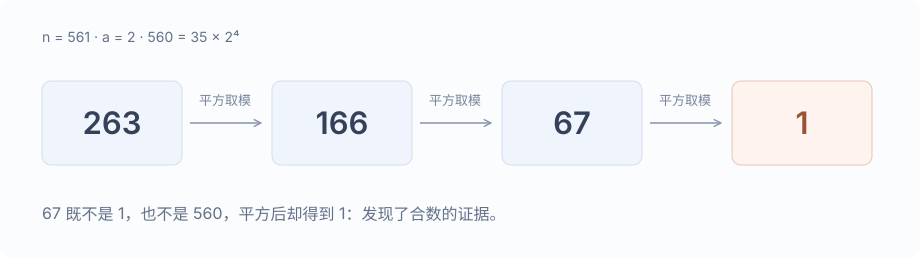

试除法是挨个找因子。Miller–Rabin 则利用素数必须满足的性质，看看能不能抓到一个反例。

它的出发点是费马小定理，但只检查费马小定理还不够，要把中间的平方过程也看一遍。

## 从费马小定理开始

如果 $p$ 是素数，$a$ 不是 $p$ 的倍数，那么

$$
a^{p-1}\equiv1\pmod p.
$$

所以，只要找到一个不满足这个式子的 $a$，就能排除素数的可能。麻烦的是，有些合数也能通过检查，比如

$$
561=3\times11\times17,\qquad 2^{560}\equiv1\pmod{561}.
$$

还得再加一道检查。

## 看看平方是怎么走到 1 的

素数模下，$x^2\equiv1\pmod p$ 可以拆成

$$
(x-1)(x+1)\equiv0\pmod p.
$$

$p$ 是素数，所以它至少整除其中一个因子，也就是 $x\equiv1$ 或 $x\equiv-1$。如果一个数既不是 $1$，也不是 $-1$，平方以后却变成了 $1$，模数就一定是合数。

对待测奇数 $n$，把指数里的因子 $2$ 全部提出来：

$$
n-1=d\,2^s,\qquad d\text{ 为奇数}.
$$

先算 $x_0=a^d\bmod n$，再不断平方。若 $n$ 是素数，要么一开始就得到 $1$，要么在最后走到 $1$ 之前，出现过 $n-1$。否则，这个基底就找到了合数的证据。

拿 $561$ 试一下。$560=35\times2^4$，以 $2$ 为基底，平方链是

$$
263\longrightarrow166\longrightarrow67\longrightarrow1.
$$

$67$ 既不是 $1$ 也不是 $560$，下一步却到了 $1$，所以 $561$ 是合数。只看费马小定理的最后一步，就会漏掉这里的问题。

## 多换几个基底

一个基底通过了，也还不能下结论。比如 $2047=23\times89$，就能通过基底 $2$ 的检查。

下面的实现对 `uint64_t` 使用常见的七基底：

$$
\{2,325,9375,28178,450775,9780504,1795265022\}.
$$

依次检查，任何一个不通过就返回合数。模乘用 `__uint128_t` 暂存乘积，代码比较直接。

## 代码

~~~cpp title="miller-rabin.cpp"
#include <array>
#include <bit>
#include <cstdint>
#include <iostream>

using u64 = std::uint64_t;
using u128 = __uint128_t;

u64 multiplyMod(u64 lhs, u64 rhs, u64 modulus) {
    return static_cast<u64>(static_cast<u128>(lhs) * rhs % modulus);
}

u64 powerMod(u64 base, u64 exponent, u64 modulus) {
    u64 result = 1;
    while (exponent != 0) {
        if (exponent & 1) {
            result = multiplyMod(result, base, modulus);
        }
        base = multiplyMod(base, base, modulus);
        exponent >>= 1;
    }
    return result;
}

bool isPrime(u64 n) {
    if (n < 2) return false;
    if (n % 2 == 0) return n == 2;

    const int s = std::countr_zero(n - 1);
    const u64 d = (n - 1) >> s;
    constexpr std::array<u64, 7> bases{
        2, 325, 9375, 28178, 450775, 9780504, 1795265022
    };

    for (u64 base : bases) {
        base %= n;
        if (base == 0) continue;

        u64 x = powerMod(base, d, n);
        if (x == 1 || x == n - 1) continue;

        bool passed = false;
        for (int r = 1; r < s; ++r) {
            x = multiplyMod(x, x, n);
            if (x == n - 1) {
                passed = true;
                break;
            }
            if (x == 1) return false;
        }
        if (!passed) return false;
    }
    return true;
}

int main() {
    std::ios::sync_with_stdio(false);
    std::cin.tie(nullptr);
    for (u64 n; std::cin >> n;) {
        std::cout << (isPrime(n) ? "Prime" : "Composite") << '\n';
    }
}
~~~

## 参考

- [CompetitiveProgramming / MillerRabin.hpp](https://github.com/huxint/CompetitiveProgramming/blob/dabd8d624388ac5c5d685483f11f6d55b75c83f3/Math/MillerRabin.hpp)
- [CP-Algorithms：Primality tests](https://cp-algorithms.com/algebra/primality_tests.html)
- [Miller–Rabin 基底记录](https://miller-rabin.appspot.com/)
