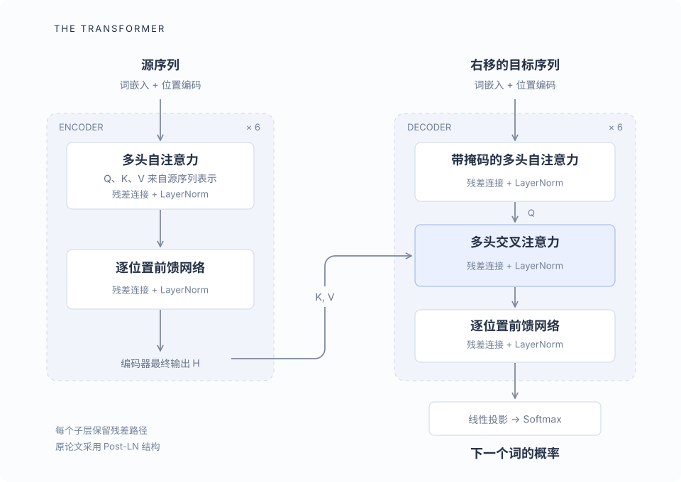

2017 年，Vaswani 等人在 [《Attention Is All You Need》](https://arxiv.org/abs/1706.03762) 中提出 Transformer。论文研究的是机器翻译：给定一种语言的句子，生成另一种语言的句子。它把序列内部的信息交换交给注意力机制，同时用前馈网络、残差连接、归一化和位置编码组成完整模型。

理解这篇论文，可以沿着一个问题展开：**一个词的表示，怎样读到句子中其他位置的信息，再成为预测下一个词的依据？**

## 任务与论文的出发点

设输入序列为 $x=(x_1,\ldots,x_n)$，目标序列为 $y=(y_1,\ldots,y_m)$。模型学习的条件概率是

$$
p(y\mid x)=\prod_{t=1}^{m}p(y_t\mid y_1,\ldots,y_{t-1},x).
$$

生成第 $t$ 个目标词时，可以使用完整输入和此前的目标词。这个分解规定了预测任务中的因果顺序。

循环神经网络按位置依次更新隐藏状态，因此一个训练样本内的计算带有顺序依赖；距离很远的两个词之间，也要经过多步状态传递。卷积可以并行处理位置，但要靠堆叠网络扩大信息传播的范围。

Transformer 采用另一种组织方式：让某个位置直接与其他允许访问的位置计算关联，并汇集它们的信息。这缩短了跨位置的信息路径，也让已知序列在训练时更容易并行处理。代价是需要显式计算位置之间的关系。

## 整体结构：编码器与解码器

原论文的 Transformer 是一个 **encoder–decoder** 模型：

- **编码器**接收源句子，为每个输入位置生成包含上下文的表示。
- **解码器**接收右移后的目标序列，结合目标侧已知上下文和编码器的输出，预测各位置的下一个词。

论文 base 模型的主要尺寸如下。后面讨论的数字都以这个配置为例。

| 参数 | 含义 | Base 配置 |
| --- | --- | --- |
| $N$ | 编码器层数、解码器层数 | 各 6 层 |
| $d_{\text{model}}$ | 每个位置的表示维度 | 512 |
| $h$ | 每层多头注意力的头数 | 8 |
| $d_k,d_v$ | 每个头的键、值维度 | 各 64 |
| $d_{\text{ff}}$ | 前馈网络中间层维度 | 2048 |

整个网络保持子层输出维度为 $d_{\text{model}}$，这样每个子层都能与输入做残差相加。注意力负责位置之间的信息交换，前馈网络负责每个位置内部的非线性变换。

## 缩放点积注意力

### Query、Key、Value 的角色

一次注意力计算需要三组向量：

- **Query（查询）**：当前位置用什么条件寻找信息。
- **Key（键）**：其他位置提供什么特征，供查询匹配。
- **Value（值）**：匹配后实际汇集的内容。

这些向量由可学习的线性变换产生。自注意力中，三者来自同一份输入表示 $X$：

$$
Q=XW^Q,\qquad K=XW^K,\qquad V=XW^V.
$$

它们共享来源，却使用不同的投影矩阵，因此通常不相等。模型在训练中同时学习“如何匹配”和“传递什么信息”。

更一般地，查询有 $n_q$ 个位置，键和值有 $n_k$ 个位置：

$$
Q\in\mathbb{R}^{n_q\times d_k},\qquad
K\in\mathbb{R}^{n_k\times d_k},\qquad
V\in\mathbb{R}^{n_k\times d_v}.
$$

$QK^\top$ 的形状是 $n_q\times n_k$。其中第 $i$ 行、第 $j$ 列的元素，表示查询 $i$ 与键 $j$ 的点积匹配分数。自注意力通常有 $n_q=n_k$；交叉注意力的两个长度可以不同。

### 从匹配分数到信息汇集

论文采用 scaled dot-product attention。把掩码也写进公式，可得到

$$
\operatorname{Attention}(Q,K,V)
=\operatorname{softmax}\left(
\frac{QK^\top}{\sqrt{d_k}}+M
\right)V.
$$

$M$ 在允许访问的位置取 $0$，在禁止访问的位置取 $-\infty$。softmax **沿键的位置维度逐行计算**：

$$
\alpha_{ij}
=\frac{\exp(s_{ij})}{\sum_{\ell=1}^{n_k}\exp(s_{i\ell})},
\qquad
o_i=\sum_{j=1}^{n_k}\alpha_{ij}v_j.
$$

这里 $s_{ij}$ 已经包含缩放和掩码。对一个拥有合法可见位置的查询，权重满足 $\alpha_{ij}\ge 0$、$\sum_j\alpha_{ij}=1$。输出是各个 Value 向量的加权和，最终形状为 $n_q\times d_v$。

这个操作可以理解成一次可学习的内容寻址：查询决定从哪里读，Value 决定读到什么。每个查询都得到自己的权重分布，因此同一句话中不同位置汇集到的上下文也不同。

### 缩放因子的作用

考虑一种用来分析量级的近似：$q_i$ 和 $k_i$ 的分量独立、均值为 $0$、方差为 $1$。此时

$$
\operatorname{Var}(q\cdot k)
=\operatorname{Var}\left(\sum_{i=1}^{d_k}q_i k_i\right)
=d_k.
$$

点积的典型幅度随 $\sqrt{d_k}$ 增长。过大的 logits 容易让 softmax 变得尖锐，使许多方向上的梯度变小。除以 $\sqrt{d_k}$ 可以把量级拉回较稳定的范围。

这是对尺度的解释；训练后的向量不必严格满足上述独立性假设。

### 一个两位置的例子

取查询 $q=(1,0)$，两个键 $k_1=(1,0)$、$k_2=(0,1)$，以及值 $v_1=(2,0)$、$v_2=(0,4)$。因为 $d_k=2$，缩放后的分数为

$$
\left(\frac{1}{\sqrt{2}},0\right).
$$

对这两个分数做 softmax，得到大约 $(0.6698,0.3302)$，因此输出为

$$
o\approx 0.6698(2,0)+0.3302(0,4)
\approx(1.34,1.32).
$$

注意力保留了两个位置的信息，并按照匹配程度分配比例。这个例子中的向量是人为选取的，实际模型中的向量由投影矩阵和输入共同决定。

## 多头注意力与表示子空间

一次注意力只能生成一组匹配关系。多头注意力让模型在多个投影空间中同时建立关系：

$$
\begin{aligned}
\operatorname{head}_i
&=\operatorname{Attention}(QW_i^Q,KW_i^K,VW_i^V),\\
\operatorname{MultiHead}(Q,K,V)
&=\operatorname{Concat}(\operatorname{head}_1,\ldots,\operatorname{head}_h)W^O.
\end{aligned}
$$

这里公式中的 $Q,K,V$ 指送入多头模块、尚未经过各个头投影的表示。对 base 模型，每个头把 512 维表示映射到 64 维，8 个头的输出拼接回 512 维，再经过 $W^O$ 混合。

不同投影使模型能够同时利用不同的关系。例如一个头可能关注邻近词，另一个头可能关注远处的关联词。头的分工由训练形成，模型结构没有给每个头预先指定语法职责。

在总表示维度固定时，各头的维度随头数缩小。因此，多头并不意味着直接复制八份完整的 512 维注意力计算。

## 位置编码：把顺序交给模型

忽略位置编码和掩码时，自注意力本身具有排列等变性：若用排列矩阵 $P$ 重排输入，则

$$
\operatorname{SelfAttention}(PX)
=P\,\operatorname{SelfAttention}(X).
$$

位置发生变化，输出跟着重排，但内容之间的匹配机制没有获得额外的先后信息。语言中的顺序却很重要，因此论文把位置编码加到词嵌入上。

原文采用正弦、余弦位置编码：

$$
\begin{aligned}
\operatorname{PE}(pos,2i)
&=\sin\left(\frac{pos}{10000^{2i/d_{\text{model}}}}\right),\\
\operatorname{PE}(pos,2i+1)
&=\cos\left(\frac{pos}{10000^{2i/d_{\text{model}}}}\right).
\end{aligned}
$$

每对维度对应一个频率，不同频率共同描述位置。对某一频率，位置平移可以写成二维旋转：

$$
\begin{bmatrix}
\sin(\theta+\phi)\\
\cos(\theta+\phi)
\end{bmatrix}
=
\begin{bmatrix}
\cos\phi & \sin\phi\\
-\sin\phi & \cos\phi
\end{bmatrix}
\begin{bmatrix}
\sin\theta\\
\cos\theta
\end{bmatrix}.
$$

这给模型利用相对位移提供了一种结构。位置编码与词嵌入维度相同，二者按元素相加；原文还将词嵌入乘以 $\sqrt{d_{\text{model}}}$。

论文也实验了可学习的位置嵌入，并观察到相近结果。正弦编码可以计算任意位置的值，但模型在更长序列上能否保持效果，仍取决于训练与泛化能力。

## 编码器的一层

编码器每层包含两个子层：多头自注意力和逐位置前馈网络。把 dropout 显式写出，一层可表示为

$$
\begin{aligned}
Z&=\operatorname{LayerNorm}\left(
X+\operatorname{Dropout}(\operatorname{MultiHead}(X,X,X))
\right),\\
H&=\operatorname{LayerNorm}\left(
Z+\operatorname{Dropout}(\operatorname{FFN}(Z))
\right).
\end{aligned}
$$

原论文采用 **Post-LN**：先做子层变换、残差相加，再做 LayerNorm。归一化针对每个位置的特征维度进行。

前馈网络为

$$
\operatorname{FFN}(x)
=\max(0,xW_1+b_1)W_2+b_2.
$$

它把 512 维向量扩展到 2048 维，经过 ReLU，再投影回 512 维。同一层中，各位置共享这套参数；不同层有各自的参数。位置之间的信息在注意力中交换，FFN 则对每个位置得到的表示做相同形式的非线性加工。

残差连接保留一条直接传递表示与梯度的路径。堆叠六层之后，每个源位置的输出都已经多次吸收并变换上下文信息。

## 解码器与因果掩码

解码器每层有三个子层：带掩码的目标侧自注意力、读取编码器输出的交叉注意力，以及前馈网络。每个子层同样配有残差连接和归一化。

### 目标侧的可见范围

预测 $y_t$ 时只能使用 $y_{<t}$。训练时，解码器输入已经右移一位：以起始符开始，后面放真实目标序列的前缀。位置 $t$ 的输入因此不是它要预测的 $y_t$。

因果掩码进一步禁止当前位置读取未来输入位置。以三个解码器输入位置为例，加入 softmax 前的掩码为

$$
M=
\begin{bmatrix}
0&-\infty&-\infty\\
0&0&-\infty\\
0&0&0
\end{bmatrix}.
$$

对角线允许访问，是因为输入已经右移。右移与掩码共同保证目标答案不会从未来位置泄漏。

Padding mask 则处理补齐长度所引入的空位。它与因果掩码解决不同问题：前者排除无效位置，后者约束时间方向。对参与计算的有效查询，应当保留至少一个合法键位置，避免整行 softmax 输入都是 $-\infty$。

### 交叉注意力连接两种序列

在 encoder–decoder attention 中：

- Query 来自解码器当前子层的表示。
- Key 和 Value 来自编码器的最终输出。

若目标长度为 $m$、源长度为 $n$，注意力权重矩阵的形状就是 $m\times n$。解码器的每个位置可以根据当前目标侧上下文，选择读取源句子中哪些位置的信息。

这也是三种注意力的联系：

| 模块 | Query 来源 | Key / Value 来源 | 可见范围 |
| --- | --- | --- | --- |
| 编码器自注意力 | 源序列 | 源序列 | 所有有效源位置 |
| 解码器自注意力 | 右移的目标序列 | 右移的目标序列 | 当前及更早的有效输入位置 |
| 编码器—解码器注意力 | 解码器表示 | 编码器最终输出 | 所有有效源位置 |

### 从表示到词的概率

解码器最终输出 $z_t$ 经过线性层，映射为词表大小的 logits，再做 softmax：

$$
p(y_t=v\mid y_{<t},x)
=\operatorname{softmax}(z_tW_{\text{vocab}}+b)_v.
$$

这里的 softmax 沿**词表维度**归一化。注意力中的 softmax 沿**键位置维度**归一化，两者产生的概率分布有不同含义。

## 训练和生成的两种过程

训练时，完整目标句子已经存在。把它右移后作为解码器输入，就能在一次前向计算中并行得到所有目标位置的预测，再计算各有效位置的损失。这种使用真实历史目标词的方式通常称为 teacher forcing。

推理时，未来目标词还没有产生。模型从起始符出发，根据已生成的前缀预测下一个词，再将新词加入前缀，继续下一步。因此，原论文这种自回归生成方式仍然逐步推进。

> 训练中的位置并行，来自“上下文已经给定、可见关系由掩码限定”。它与推理时逐词生成的条件概率分解可以同时成立。

原文的训练方案还包含以下设置：

- 使用 Adam，参数为 $\beta_1=0.9$、$\beta_2=0.98$、$\epsilon=10^{-9}$。
- Base 模型使用 $0.1$ 的 dropout，以及系数为 $0.1$ 的 label smoothing。
- 学习率先预热，再按步数的平方根倒数衰减：

$$
\operatorname{lrate}
=d_{\text{model}}^{-1/2}
\min\left(
\operatorname{step}^{-1/2},
\operatorname{step}\cdot\operatorname{warmup}^{-3/2}
\right),
\qquad \operatorname{warmup}=4000.
$$

这些设置说明论文中的结果来自完整的模型与训练方案。注意力公式是核心部件，但它还需要与表示、归一化、优化过程协同工作。

## 计算代价与论文结果

对于长度为 $n$、表示维度为 $d$ 的序列，注意力的两次位置混合矩阵乘法需要约 $O(n^2d)$ 次算术操作。线性投影和前馈网络还会带来 $O(nd^2)$ 量级的开销；后者这里假定前馈中间维度与 $d$ 成比例。

直接存储一个头的完整注意力矩阵需要 $O(n^2)$ 空间。因此，序列变长时，位置两两交互会成为重要成本。

论文特别比较了信息传播路径：在全连接的自注意力层里，两个位置可以直接建立联系；循环模型则可能经过与距离相关的多步传递。这种短路径和训练并行性，是 Transformer 的重要优势。

原文的 **big** 模型在 WMT 2014 英德翻译上报告了 28.4 BLEU，在英法翻译上报告了 41.8 BLEU。这些是论文对应数据、训练设置与评估流程下的结果，不能直接当作不同年代、不同任务之间的统一排名。

## 几个需要分清的概念

**注意力权重与解释。** 权重可以帮助观察某一层如何汇集 Value，但输出还会经过投影、残差、前馈网络和后续层。单张注意力图不等同于完整模型的因果解释。

**原版 Transformer 与后续模型。** 原论文使用 encoder–decoder、正弦位置编码、ReLU 前馈网络和 Post-LN。后来的模型可能采用 decoder-only、旋转位置编码、门控前馈网络或 Pre-LN。阅读现代模型时，需要分别确认这些选择。

**位置匹配与上下文表示。** 一个位置在深层中携带的信息，已经包含前面多层汇集的上下文。注意力连接的是不断更新的表示，而不只是最初的独立词向量。

沿着整条计算链看，源词先被编码成上下文表示；目标前缀通过带掩码的自注意力组织历史，再通过交叉注意力读取源句；最终的表示被投影成下一个词的概率。论文中的各个部件，都可以放回这条链上理解。

## 参考资料

1. Vaswani et al. [Attention Is All You Need](https://arxiv.org/abs/1706.03762), 2017。结构、注意力与位置编码见第 3 节，计算比较见第 4 节，训练和实验见第 5、6 节。
2. [论文 PDF](https://arxiv.org/pdf/1706.03762)。本文结构图根据原文重绘，参数与实验结果均按原文配置区分。
